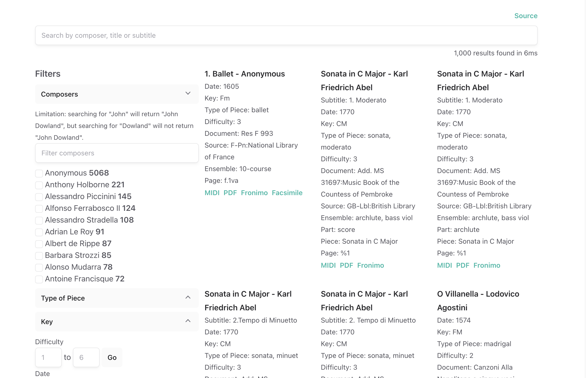

TL;DR checkout the [improved search experience](/lute-search).

A user contacted me asking how they could search for a given composer (Anthony Holborne), a given type of music (galliard), and then further refinements based on other properties (title, key etc.). Before, you could add all these search terms in the input and get relevant results. But results would include pieces by Holborne that weren't galliards, and galliards not by Holborne.

Luckily for me, there has been a recent [update to Meilisearch](https://github.com/meilisearch/meilisearch/releases/tag/v1.3.0), the underlying search engine, that allows us to create "facets" and search through them. The user is now able to further refine their search with a UI that looks like this:



## Frontend

The UI implementation is greatly simplified by `react-instantsearch-dom` from Algolia. However, I noticed that the lib is now [deprecated](https://www.npmjs.com/package/react-instantsearch-dom) in favour of [react-instantsearch](https://www.npmjs.com/package/react-instantsearch). So I took this opportunity to upgrade, which had some nice improvements around styling elements.

Previously, I was styling the class name in my `css` file, but now we can style within the jsx like this:

```tsx
<CurrentRefinements
  classNames={{
    item: 'w-max space-x-1 bg-teal-400 dark:bg-teal-600 rounded px-2 py-1',
    category: 'space-x-1 block',
    list: 'space-y-1',
  }}
/>
```

## Backend

To update my Meilisearch deployment, I just needed to bump the tag in my docker compose file and run `docker compose up -d`. To enable the refinements feature, I needed to update my Rust code that seeds Meilisearch, adding the properties I want the user to be able to filter on. That was a simple as this:

```rust
index.set_filterable_attributes(["difficulty", "date", "composer", "type_of_piece", "key"])
```

And then it all just works and is extremely fast!

## Diffs

If you are interested in seeing the diffs, here is the [frontend code](https://github.com/Rigellute/blog/pull/56) and the [seeding code](https://github.com/Rigellute/lute-spreadsheet-to-meilisearch/commit/8a9bd54363e28a7cee5d8f04d7c7615685dace3f).
