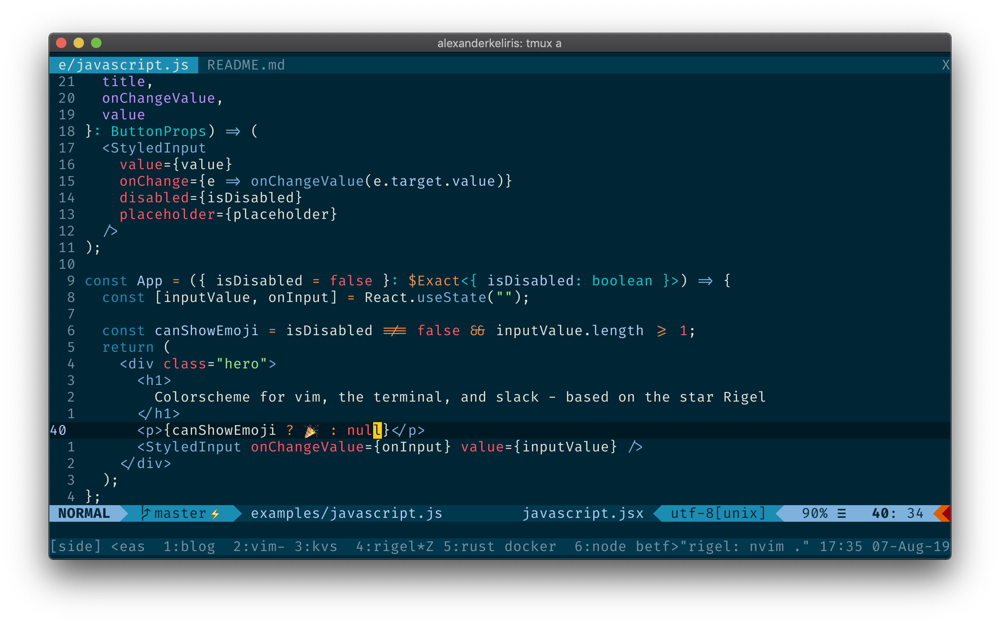
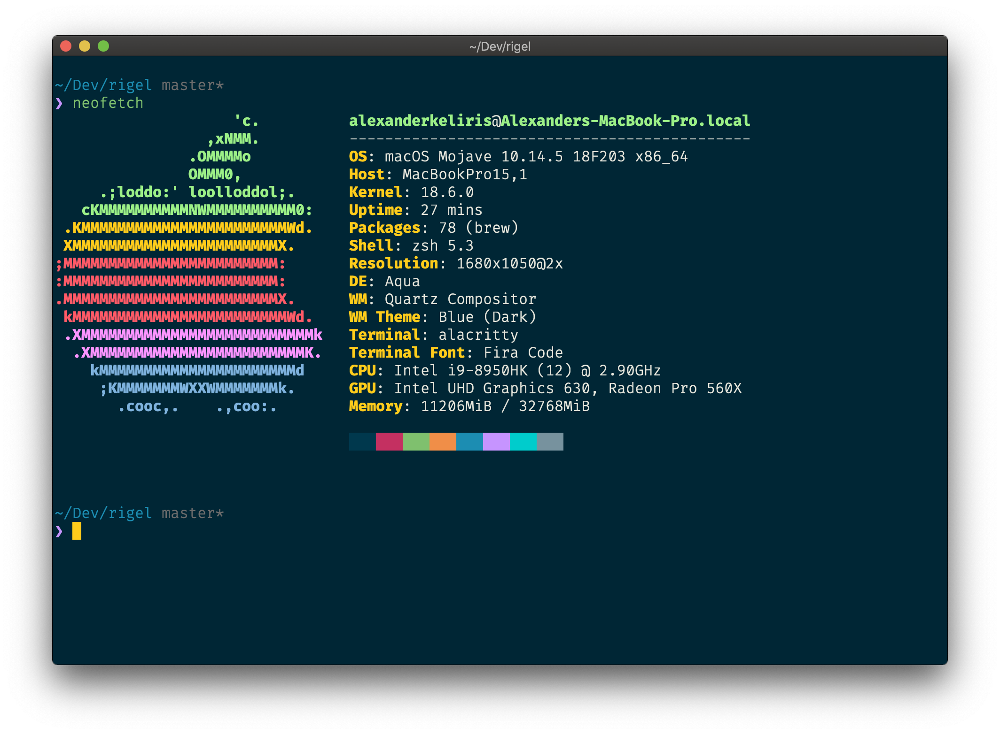

This colorscheme is based on the star [Rigel](https://en.wikipedia.org/wiki/Rigel) - the bright blue star in the constellation of Orion.

And earlier iteration of this blog used the colors from the `Rigel` palette.

The `Rigel` colorscheme has been implemented for a number of different applications, including [vim](https://rigel.netlify.com/#vim) and the [terminal](https://rigel.netlify.com/#terminal).

For guides on how to install and use `Rigel`, check [the Rigel homepage](https://rigel.netlify.com/).

If you spot something that doesn't look right, please create an issue on [Github](https://github.com/Rigellute/rigel).

## Screenshots

### Vim

### Terminal

