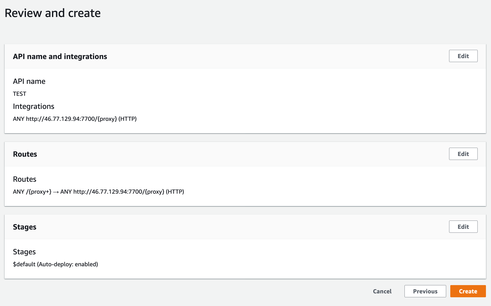

When working with your own APIs you nearly always want to be using `HTTPS`.

This is especially true when using the API from a browser. Most modern browsers will block [mixed content](https://support.mozilla.org/en-US/kb/mixed-content-blocking-firefox). When your front end is being served from an `HTTPS` domain, making insecure `HTTP` requests will be blocked.

Setting up HTTPS termination for your servers is painful. It usually involves purchasing an SSL certificate from a third party and then modifying configuration files on your instance. You'll also need to manage renewing the certificate once it has expired.

The simplest way to use HTTPS with an AWS Elastic Beanstalk environment is to assign a [AWS Certificate Manager (ACM)](https://aws.amazon.com/certificate-manager/) certificate to your environment's load balancer (more [here](https://docs.aws.amazon.com/elasticbeanstalk/latest/dg/configuring-https.html)). With this setup, you get a free SSL certificate and ACM will manage renewing the certificate.

This is great if you actually need a load balancer to route requests between multiple instances. But introduces higher cost especially when you only need a single instance.

An even easier, and cost effective, solution is to create an [AWS API Gateway HTTP API](https://docs.aws.amazon.com/apigateway/latest/developerguide/http-api.html) to serve as a proxy for your instance.

This is the solution I used for my [lute search](/lute-search) project. The proxy has added very little latency to my search API and will cost \$1 per million requests!

## Steps to create HTTP API proxy

Assuming you already have a web server running somewhere with a routable HTTP endpoint, follow these steps to create a proxy with HTTPS.

- On the AWS Console, navigate to API Gateway
- Click "Create API"
- Choose "HTTP API" by pressing "Build"
- Click "Add integration" and choose "HTTP" from the drop down
- To forward all requests to your server, make sure you have "ANY" for the "Integration Type"
- Enter your server URL and add `/{proxy}` at the end of the URL. Should look like this:
  
- Enter a name and click next
- On this next page the "Resource Path" field will be automatically populated, but this might be wrong if it looks like this `/%7Bproxy%7D`
- Replace the value in that field to `/{proxy+}`
  
- Click next
- You can accept the defaults on this page if you're happy with the default stage
  
- Click next and review your API
  
- Finally, click create and wait for your HTTP API proxy to be deployed. This should only take a minute or so

Now you can use your new HTTPS endpoint just as you would the endpoint from your server!

## Additional goodies

You can manage your CORS configuration and [access control](https://docs.aws.amazon.com/apigateway/latest/developerguide/http-api-jwt-authorizer.html) (authorization) to restrict client access to your APIs from the API Gateway console.

## Conclusion

This solution is easy to setup and maintain. It is cheap to run and is great for side projects - proven to be a great solution for my [lute search](/lute-search) side project.
